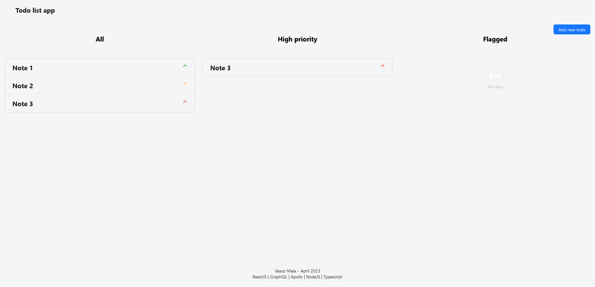
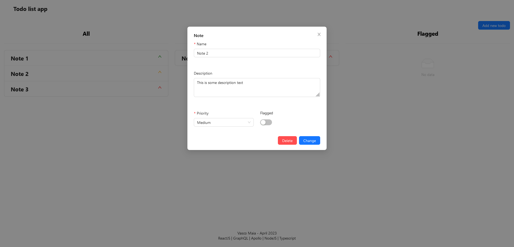

# Todo Application with GraphQL

</img>
</img>

This is a personal project of a simple todo application that allows users to create, read, update and delete tasks.

The application is built with ReactJS and GraphQL on the frontend, and NodeJS and TypeScript on the backend.

This was made as an exercise to familiarize my self with the technology stack of this project, with special emphasis on GraphQL and Apollo.

## Getting Started

To get started, clone this repository to your local machine and follow the instructions below.

## Technology Stack

-   Frontend
    -   ReactJS
    -   GraphQL
    -   Apollo Client
    -   Ant Design
-   Backend
    -   NodeJS
    -   TypeScript
    -   GraphQL
    -   Apollo Server

## Prerequisites

-   Node.js
-   npm or yarn

## Installation

1. Clone the repository:

```
git clone https://github.com/vmmaia/graphql_todo_app
```

2. Navigate to the root directory:

```
cd todo-app
```

3. Install the dependencies:

```
npm install
```

4. Create a .env file in the backend directory and set the following environment variables:

```
PORT=5000
```

## Running the Application

1. Start the backend server:

```
npm run dev
```

2. Start the frontend development server:

```
npm start
```

The application will be available at **http://localhost:3000**.
